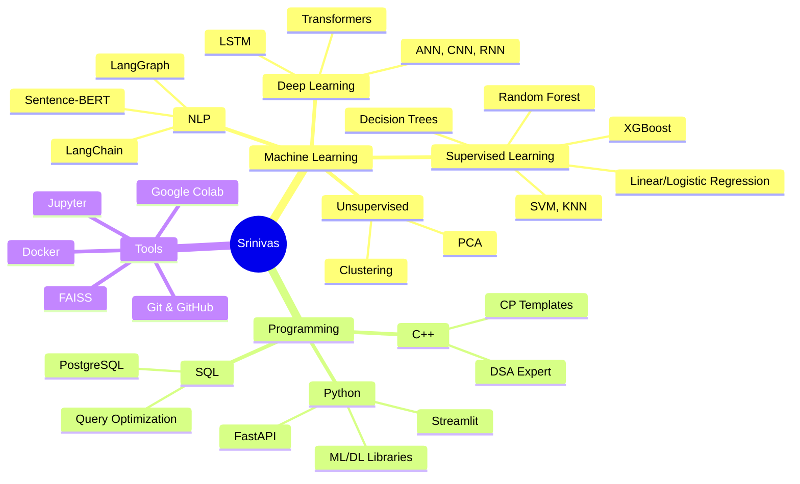

<div align="center">

# 👋 Hey there! I'm Srinivas Prabhu


[](https://github.com/srinivas0721)
[](https://github.com/srinivas0721)
[](https://linkedin.com/in/srinivas-prabhu-910978290)

</div>

---

## 🚀 About Me

```python
class SrinivasPrabhu:
    def __init__(self):
        self.username = "srinivas0721"
        self.education = "B.Tech ECE @ IIIT Una"
        self.cgpa = 8.92
        self.role = "ML Engineer & Competitive Programmer"
        self.location = "Una, Himachal Pradesh"
        self.achievements = [
            "Amazon ML Summer School 2025 Scholar",
            "Codeforces Specialist (srini_0721)",
            "CodeChef 3⭐ (srini_0721)",
            "Ranked 1181 in CodeFest'25 Prelims"
        ]
        
    def current_focus(self):
        return ["Deep Learning", "NLP", "LangChain", "System Design"]
    
    def say_hi(self):
        print("Building intelligent systems, one algorithm at a time! 🚀")

me = SrinivasPrabhu()
me.say_hi()
```

🎓 **B.Tech in Electronics & Communication Engineering** @ IIIT Una (CGPA: 8.92/10)  
🏆 **Amazon ML Summer School 2025** - Selected among top students nationwide  
🔥 **Codeforces Specialist** | **CodeChef 3⭐** (Working towards 4⭐)  
🌟 **CodeFest'25 Rank 1181** (IICPC - HRT, Jump Trading, Jane Street, Citadel)

- 🔭 Currently building **AI-powered interview systems** and **semantic search engines**
- 🌱 Learning **Advanced ML techniques, LangChain/LangGraph, System Design**
- 💬 Ask me about **CP, ML/DL, NLP, FastAPI, LangChain**
- 📫 Reach me: **srinivasprabhu557@gmail.com**
- ⚡ Fun fact: **I debug code faster than I solve a Rubik's cube!**

---

## 🛠️ Tech Stack

<div align="center">

### Languages


### Machine Learning & AI


### Data Science & Visualization


### Frameworks & Tools


</div>

---

## 📊 GitHub Stats

<div align="center">


</div>

<div align="center">


</div>

---

## 🏆 Featured Projects

<div align="center">

### 🎤 AI-Powered Interview Bot
[](https://github.com/srinivas0721/InterviewBot)

**End-to-end ML workflow for automated interview evaluation**
- 🤖 Built with **LangChain + LangGraph + Google Gemini**
- 📊 Multi-criteria scoring: clarity, depth, confidence, relevance, structure
- 🚀 **FastAPI + PostgreSQL** stack for real-time inference
- 📈 Session management with personalized feedback & analytics

**Tech:** `Python` `LangChain` `LangGraph` `FastAPI` `PostgreSQL` `Google Gemini`

[🔗 View Project](https://github.com/srinivas0721/InterviewBot) | **Status:** 🟢 Ongoing

---

### 📚 Smart Book Recommender System
[](https://github.com/srinivas0721/book_recommendation_system)

**Full-stack semantic search platform with 10K+ books**
- 🔍 Semantic search using **Sentence-BERT + FAISS**
- 📖 Integrated Anna's Archive API + OpenLibrary for metadata
- 💾 User management with **PostgreSQL + Streamlit**
- 🎯 NLP-powered suggestions with search history & favorites

**Tech:** `Python` `Sentence-BERT` `FAISS` `PostgreSQL` `Streamlit` `NLP`

[🔗 View Project](https://github.com/srinivas0721/book_recommendation_system)

---

### 🧠 Universal CP Assistant
[](https://github.com/srinivas0721/CodingAssistant)

**AI Chrome extension for competitive programming**
- 💡 Real-time hints for **LeetCode, Codeforces, CodeChef**
- 🎯 Multi-language solutions (Python, C++, Java)
- ⚡ Complexity analysis powered by **Google Gemini API**
- 🚀 FastAPI backend deployed on Render

**Tech:** `JavaScript` `FastAPI` `Google Gemini` `Chrome Extension`

[🔗 View Project](https://github.com/srinivas0721/CodingAssistant)

---

### 🛡️ Spam Detection System
[](https://github.com/srinivas0721/Spam-Detection)

**ML-powered spam classification with NLP**
- 🔍 Advanced text classification algorithms
- 🤖 High accuracy spam filtering
- 📊 Feature engineering & model optimization

**Tech:** `Python` `Machine Learning` `NLP` `Scikit-Learn`

[🔗 View Project](https://github.com/srinivas0721/Spam-Detection)

---

### ⚡ CP Template
[](https://github.com/srinivas0721/cp_template)

**Competitive programming template for lightning-fast coding**
- 📝 Pre-built C++ templates with macros
- ⚡ Optimized for contest speed
- 🎯 Battle-tested in 100+ contests

**Tech:** `C++` `Competitive Programming`

[🔗 View Project](https://github.com/srinivas0721/cp_template)

</div>

---

## 🎯 Competitive Programming

<div align="center">

[](https://codeforces.com/profile/srini_0721)
[](https://www.codechef.com/users/srini_0721)
[](https://leetcode.com/srinivas0721)

### 🏅 CP Achievements
- 🥇 **Codeforces Specialist** (srini_0721)
- ⭐ **CodeChef 3⭐** - Progressing towards 4⭐
- 🏆 **CodeFest'25 Rank 1181** (IICPC - Sponsored by HRT, Jump Trading, Jane Street, Citadel)
- 💻 Active problem solver with **500+ problems solved**

</div>

---

## 🎓 Education & Achievements

<table align="center">
<tr>
<td align="center" width="50%">

### 🎓 Education
**Indian Institute of Information Technology, Una**  
B.Tech in ECE | CGPA: **8.92/10**  
📅 Aug 2023 – May 2027

**HSC:** 81.67% | **SSC:** 93.4%

</td>
<td align="center" width="50%">

### 🏆 Key Achievements
✅ **Amazon ML Summer School 2025**  
Selected among top students nationwide

🔥 **Codeforces Specialist**

⭐ **CodeChef 3-Star**

🏅 **CodeFest'25 Rank 1181**

</td>
</tr>
</table>

---

## 💼 Positions of Responsibility

<div align="center">

| Organization | Role | Description |
|-------------|------|-------------|
| **EUNOIA** (Literary & Dramatics Club) | Member | IIIT Una |
| **AAVESH** (Electronics Club) | Public Relations Head | IIIT Una |

</div>

---

## 📈 Contribution Activity

<div align="center">


</div>

---

## 🎯 Skills Overview

<div align="center">



</div>

---

## 💼 Connect With Me

<div align="center">

[](https://linkedin.com/in/srinivas-prabhu-910978290)
[](mailto:srinivasprabhu557@gmail.com)
[](https://codeforces.com/profile/srini_0721)
[](https://www.codechef.com/users/srini_0721)
[](https://github.com/srinivas0721)

</div>

---

<div align="center">

### 💭 Random Dev Quote


---

### 🏆 GitHub Trophies


---

### 👁️ Profile Views


---


**💙 Thanks for visiting! Let's connect and build something amazing together!**

</div>
